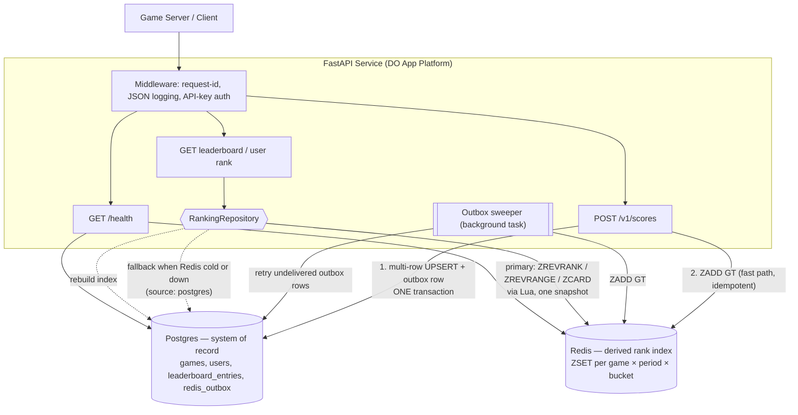

# Leaderboard Service

A real-time global gaming leaderboard REST API. Ranks users by score across
multiple games, over all-time, daily and weekly windows.

Postgres is the system of record; Redis sorted sets are a derived, rebuildable
index that answers rank queries in `O(log N)`. If Redis is unavailable the
service keeps serving from Postgres and reports `degraded` — it does not fail.

**Design rationale, including the tradeoffs that were rejected, is in
[Spec.md](Spec.md).** This README covers running it.

> **Status: Phase 1 (data layer).** Configuration, logging, the error
> envelope, readiness, container and CI are complete. The schema, migrations
> and period bucketing are in place, and the Postgres/Redis ranking agreement
> that the whole design rests on is verified against both real engines. The
> `/v1` endpoints land in Phases 2–3 — see [Roadmap](#roadmap).

---

## Quick start

```bash
git clone https://github.com/poornima1390/LeaderboardService.git
cd LeaderboardService

cp .env.example .env     # local defaults work as-is
make up                  # Postgres + Redis + API in Docker
curl -s localhost:8080/health | jq
```

Interactive API docs: <http://localhost:8080/docs>

### Without Docker

```bash
make install             # creates .venv, installs pinned dependencies
cp .env.example .env
# Point DATABASE_URL / REDIS_URL at your own instances, then:
make migrate
make run                 # http://localhost:8080
```

`make help` lists every target.

---

## Architecture



**Write path.** Authenticate → validate → resolve the game → compute the three
period buckets → one transaction containing three conditional UPSERTs plus
three outbox rows → commit → best-effort `ZADD GT` ×3 → read back ranks →
respond.

**Read path.** Validate → resolve the game → `RankingRepository` → a Redis Lua
script returning rank, window and total from one consistent snapshot → hydrate
display names from Postgres in a single query → respond.

### The five decisions that shape everything

| | Decision | Why, and what it cost |
|---|---|---|
| **D1** | A submission keeps `max(existing, submitted)` | Idempotent and commutative, so retries and concurrent writes are safe with no idempotency keys and no row locks. Cost: no per-submission history. |
| **D2** | Redis sorted sets for ranking, Postgres as source of truth | A single user's rank in Postgres is `COUNT(*)` of everyone better — unbounded. `ZREVRANK` is `O(log N)`. Cost: a second stateful system, mitigated by keeping Redis purely derived. |
| **D3** | Canonical order is `score DESC, user_id DESC`, `COLLATE "C"` | Both stores must agree on ties byte-for-byte. Cost: loses "earliest achiever wins" — see below. |
| **D4** | Conditional UPSERT, then a transactional outbox to Redis | `ZADD GT` never lowers a score, making the sync idempotent *and* order-independent, so at-least-once delivery needs no consistency protocol. |
| **D5** | A board is `(game, period, bucket)` | Weekly/daily boards are the first thing anyone asks for and retrofitting rewrites every query. Cost: a fixed 3× write fan-out. |

Two details in D3 are easy to get wrong, and both are now verified against
real Postgres and real Redis rather than argued:

- `ZREVRANGE` and `ZREVRANK` order equal scores by member **descending**, so
  Postgres must be `user_id DESC` — not `ASC`.
- Redis compares member bytes; Postgres `text` ordering follows the database
  collation, which is generally *not* byte-wise. Hence `COLLATE "C"` on the
  column.

The second point was measured, because it is the one that would otherwise pass
locally and fail in production. Inside a database whose own collation is
`en_US.utf8`, the two orderings are:

```
redis         : alpha, player_a, player_99, player_77, player_2, player_1204, ...
pg COLLATE C  : alpha, player_a, player_99, player_77, player_2, player_1204, ...   agrees
pg default    : alpha, player.c, player-b, Player_A, player_a, player_99, ...       diverges
```

glibc collation reorders punctuation and case, so a column that omits
`COLLATE "C"` silently produces a different leaderboard from the rank index.
Because the guarantee lives on the *column*, it holds regardless of the
managed database's own collation — which we do not control on DigitalOcean.
Local and CI Postgres are therefore configured with a deliberately **non-C**
collation, so a column that forgets its `COLLATE` fails the build instead of
passing and breaking in production.

"Earliest achiever wins a tie" would be the better product rule, but a Redis
ZSET score is a `double` with 53 bits of exact integer precision. Packing an
inverted timestamp alongside the score needs ~33 of them, leaving ~20 — a hard
cap of ~1M on any score. That tradeoff was rejected; the alternative is
documented in [Spec.md §2a](Spec.md).

---

## Configuration

Every setting comes from the environment. **The service refuses to start** if a
required variable is missing or malformed, rather than booting in a subtly wrong
state. See [.env.example](.env.example) for the full list.

| Variable | Required | Notes |
|---|---|---|
| `DATABASE_URL` | yes | `postgresql://` is rewritten to `postgresql+asyncpg://`, and `?sslmode=` is moved into `connect_args` — both needed for a DigitalOcean URL to work at all |
| `API_KEY` | yes | Score submission. ≥16 chars; placeholder-looking values are rejected |
| `ADMIN_API_KEY` | yes | Index rebuild only, so a leaked game-server key cannot trigger one |
| `REDIS_URL` | no | Absent ⇒ `degraded`: reads fall back to Postgres |
| `DB_STATEMENT_CACHE_SIZE` | no | **Set to `0`** behind a transaction-mode pooler (PgBouncer, DO connection pool) |

---

## Health and observability

`GET /health` distinguishes "cannot serve" from "serving degraded", which is
the distinction a load balancer acts on:

| Postgres | Redis | Status | HTTP | Why |
|---|---|---|---|---|
| up | up | `ok` | 200 | |
| up | down / absent | `degraded` | **200** | Reads fall back to Postgres and writes still commit durably. 503 here would empty the LB pool over a cache outage. |
| down | any | `unhealthy` | 503 | Nothing can be served or written. |

Logs are JSON lines, one access line per request, with `request_id` bound to
every line emitted during that request. The same id is returned in the
`X-Request-ID` header and in `error.request_id`, so a user reporting a failure
hands over the exact key needed to find it. A client-supplied `X-Request-ID` is
propagated when well-formed and discarded otherwise — it ends up in our log
stream, so it is untrusted input.

---

## Errors

One envelope for every failure, including ones FastAPI would otherwise answer
in its own `{"detail": ...}` shape:

```json
{
  "error": {
    "code": "VALIDATION_ERROR",
    "message": "Request validation failed",
    "details": [{ "field": "score", "issue": "greater_than_equal", "value": -50 }],
    "request_id": "01JD8FQK3M2P9VX7ABCDEF1234",
    "documentation_url": "https://.../docs/errors.md#validation_error"
  }
}
```

Clients branch on `code`, never on `message`. Full reference:
[docs/errors.md](docs/errors.md).

---

## Testing

```bash
make test        # pytest
make check       # lint + types + tests, in CI's order
make test-cov    # with coverage
```

Tests needing live Postgres or Redis are marked `integration` and skipped when
those are unreachable, so `make test` works on a bare checkout. CI runs against
real Postgres 17 and Redis 7 service containers — the design's central risk is
the two stores disagreeing about ranking, and a mock cannot disagree with
anything.

**191 tests, 92% coverage.** 132 unit tests run with no dependencies; 59
integration tests run against real Postgres and Redis and skip cleanly when
those are absent.

Coverage worth calling out:

- **Ranking agreement (D2/D3)** — the same standings written to both stores
  must produce identical ordering, ranks, windows and totals. Checked against
  adversarial identifiers (case, punctuation, numeric-looking suffixes) and
  across 40 seeded random boards with a deliberately small score range, so
  ties — the only place the stores can disagree — are common.
- **Constraints** — every CHECK and foreign key is tested by trying to violate
  it. A constraint nobody has seen reject anything is a comment, not a
  guarantee.
- **Index usage** — `EXPLAIN` asserts top-N is an index-only scan with no
  `Sort` node. Without the index the query still returns correct rows, so only
  the plan catches the regression, and the Postgres path is the fallback that
  runs when the system is already under stress.
- **ISO week boundaries** — `2027-01-01` belongs to ISO week 53 of *2026*.
  Using the calendar year would split one week's leaderboard across two
  buckets that share no scores.
- **Float64 precision** — `MAX_SCORE` round-trips through a Redis sorted set
  score without rounding.

---

## Deployment

CI (`.github/workflows/ci.yml`) runs lint, `mypy --strict`, tests against real
Postgres and Redis, a reversible-migration check, a model/migration drift check
(`alembic check`), and a Docker build whose image is booted and probed.

**Not yet deployed.** The App Platform spec and deploy script are complete but
unapplied, deferred until Phases 2–3 give the service endpoints worth serving.
Once applied, the spec's `deploy_on_push: true` makes merges to `main` deploy
automatically.

```bash
export LB_API_KEY=$(openssl rand -hex 32)
export LB_ADMIN_API_KEY=$(openssl rand -hex 32)
./scripts/deploy_do.sh
```

The script renders [.do/app.yaml](.do/app.yaml), substituting only our own
placeholders so App Platform's `${leaderboard-db.DATABASE_URL}` binding passes
through intact, then creates or updates the app idempotently. No secret is
committed.

Migrations run as a `PRE_DEPLOY` job, never at startup: concurrent instances
racing to migrate is a reliable way to corrupt a deploy.

The deployment attaches Postgres but **not** Redis — DigitalOcean has no free
managed Valkey tier, so Phase 0 runs the degraded path for real rather than
pretending it works. `.do/app.yaml` documents the three lines that add it.

---

## Roadmap

| Phase | Scope | Status |
|---|---|---|
| **0** | Config, logging, error envelope, `/health`, Docker, CI | ✅ done |
| **1** | Models, migrations, period bucketing, ranking-agreement proof | ✅ done |
| **2** | `POST /v1/scores`: UPSERT fan-out, outbox, `ZADD GT` (D1/D4) | next |
| **3** | `RankingRepository`: Redis Lua + Postgres fallback, both read endpoints (D2/D3) | |
| **4** | Failure-mode tests, admin rebuild, deployment | |

Explicitly out of scope, with reasoning, in [Spec.md §9](Spec.md) — including
per-user auth, rate limiting, anti-cheat and local-time period boundaries.

## Project layout

```
app/
  main.py                app factory, lifespan
  api/health.py          readiness, with injectable probes
  core/config.py         Settings; fail-fast validation, DO URL normalisation
  core/errors.py         error codes, envelope, handlers
  core/logging.py        structlog over the stdlib bridge
  core/middleware.py     request ids, access log, body size limit
  core/db.py             engine and Redis client lifecycle
  domain/periods.py      Period, BoardKey, UTC bucketing, D5 fan-out
  domain/identifiers.py  id patterns and score bounds, shared by API + schema
  models/entities.py     the four tables; COLLATE "C" lives here
migrations/              Alembic; URL comes from app settings
tests/unit/              no live dependencies needed
tests/integration/       real Postgres + Redis; skipped when absent
.do/app.yaml             App Platform spec (placeholders, no secrets)
scripts/deploy_do.sh     idempotent create-or-update deploy
```
