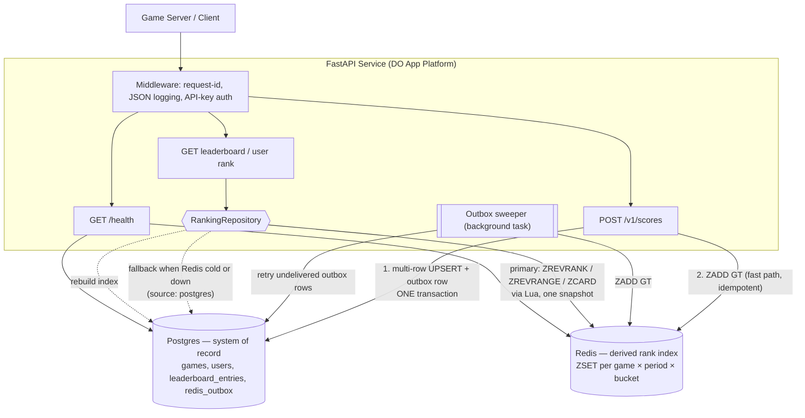

# SPEC.md

---

## 1. Service Summary

Project Objective
Summary: Build a production-ready REST API service to manage a global gaming leaderboard that ranks users based on their scores in real-time across different games.

Functional Expectations
At a minimum, your service should demonstrate:

Submit Score: Accept a user ID and a score update for different games.
Top X Rank: Return the top users (e.g. top 10 or 100) sorted by their score.
User Context: Return a specific user’s current rank along with the users immediately above and below them (their leaderboard “surroundings”).

Engineering Expectations
Your solution should reflect what you believe constitutes a production-ready service. We require:

Architecture Flow Diagram: Include a diagram in your repository mapping the request lifecycle and data flow at a high level. This will serve as the anchor for your technical review.
Validation: Sensible error handling, input validation, and edge-case management.
Testing: Unit or integration tests that demonstrate correctness.
CI/CD: A basic pipeline configuration (e.g., GitHub Actions).
Documentation: A well-organized codebase and a README providing clear setup, execution, and testing instructions.

Extensions & Next Steps
If time permits, you are encouraged to expand on your solution:

Deployment: Deploy your service to DigitalOcean.
Customer-Centric Features: Add additional features you would expect a product like this to have, using your imagination and thinking from a customer's perspective.

## 2. Tech Stack

- **Language / framework:** Python, FastAPI (async endpoints throughout)
- **Validation:** Pydantic v2 models (`extra="forbid"` on all request bodies)
- **Data access:** SQLAlchemy 2.0 async + asyncpg; Alembic for migrations
- **Database:** Postgres — system of record
- **Rank index:** Redis 6.2+ sorted sets — derived, rebuildable index for `O(log N)` rank lookups
- **Testing:** pytest + `httpx.AsyncClient`; real Postgres + Redis in Docker (no mocks for store behaviour)
- **Deployment target:** DigitalOcean App Platform + Managed Postgres + Managed Redis

---

## 2a. Core Design Decisions

The five decisions below shape everything after this point. Each is recorded with what it
bought and what it cost, because the cost is the part worth discussing in review.

### D1 — Score semantics: best score wins

A submission sets a user's standing to `max(existing, submitted)`. Chosen over cumulative and
last-write-wins because:

- It is **naturally idempotent**. A retried or duplicated `POST` cannot corrupt state, so the
  service needs no idempotency-key infrastructure on its hottest endpoint.
- It is **commutative**, so concurrent submissions converge to the same answer regardless of
  arrival order — no row locks held across a round trip, no read-modify-write window.
- It matches how players understand an arcade leaderboard: your standing is your personal best.

Cost: no per-submission history, so we cannot answer "show me my last 20 games" or do
retrospective cheat analysis. Deferred deliberately (§9) — adding an append-only
`score_events` table later is additive and breaks nothing.

### D2 — Ranking: Redis sorted sets, Postgres as source of truth

Postgres alone can serve top-N cheaply from a covering index, but a *single user's rank* is
`COUNT(*) WHERE score > mine` — a scan of every row ranked better, which grows without bound on
a popular game. `RANK() OVER ()` is worse: it sorts the whole partition. Since "return a
specific user's rank" is a first-class requirement and the brief says *real-time* and *global*,
the rank lookup is the workload, not an afterthought.

Redis sorted sets answer all three requirements in logarithmic or constant time:

| Operation | Redis | Postgres-only |
|---|---|---|
| Top N | `ZREVRANGE 0 N-1` — `O(log N + n)` | index-only scan, ~`O(n)` — also fine |
| One user's rank | `ZREVRANK` — `O(log N)` | `COUNT(*)` of better rows — **unbounded** |
| ±k window around a user | `ZREVRANK` + `ZREVRANGE` — `O(log N + k)` | rank subquery + offset — **unbounded** |
| Total entries on a board | `ZCARD` — `O(1)` | `COUNT(*)` — `O(n)` |

The cost is a second stateful system, and the honest risks are dual-write failure, cold start,
and eviction. D3 and D4 address those directly. **Postgres remains the only system of record**;
Redis holds nothing that cannot be reconstructed from it, so the worst case for a Redis failure
is degraded latency, never data loss.

Both implementations sit behind one `RankingRepository` protocol, and **both are shipped**:

- `RedisRanking` — the serving path.
- `PostgresRanking` — used for index rebuilds, for the degraded path when Redis is unavailable,
  and as the test oracle in §10's differential tests.

Keeping the Postgres implementation is not redundancy for its own sake: the rebuild path needs
it anyway, and having two independent implementations of the same contract turns cross-store
consistency into something we can assert in CI instead of hope for.

### D3 — Tie ordering: Redis' native order, mirrored exactly in Postgres

Two stores answering the same ranking question must agree **byte for byte**, including ties.
Two details make this non-obvious:

1. Redis orders equal-scored members lexicographically by member, and `ZREVRANGE` / `ZREVRANK`
   reverse that — so ties come back in **descending** `user_id` order.
2. Redis compares member bytes directly (`memcmp`). Postgres `text` ordering follows the
   database collation, which is generally *not* byte-wise (`en_US.UTF-8` ignores punctuation
   differently, for one).

So the canonical order is:

```
score DESC, user_id DESC          -- user_id column declared COLLATE "C"
```

`COLLATE "C"` is declared on the column itself rather than per-query, so every query, index and
`ORDER BY` is byte-wise by construction and no future query can silently drift from Redis.

**What this costs.** The rule becomes "higher `user_id` wins a tie" — deterministic and stable,
but arbitrary. The rule I'd prefer is "whoever got there first wins," which requires packing
score and time into the single `double` a ZSET score provides. That budget is 53 bits of exact
integer precision; an inverted second-resolution timestamp with a usable horizon needs ~33 of
them, leaving ~20 — a hard ceiling of ~1M on any score. **Trading a 1M score cap for a nicer
tiebreak is not worth it**, so we take the native order and document the alternative.

### D4 — Write path: conditional UPSERT, then transactional outbox to Redis

A submission is one Postgres statement per affected board:

```sql
INSERT INTO leaderboard_entries (game_id, period, period_bucket, user_id, score, achieved_at)
VALUES (...)
ON CONFLICT (game_id, period, period_bucket, user_id) DO UPDATE
  SET score = EXCLUDED.score,
      achieved_at = EXCLUDED.achieved_at,
      updated_at = now()
  WHERE EXCLUDED.score > leaderboard_entries.score
RETURNING score, achieved_at;
```

The `WHERE` on `DO UPDATE` enforces max-semantics inside the statement — atomic, lock-free from
the application's view, and it returns no row when the submission did not improve the standing,
which is exactly the `improved: false` signal the API reports back.

Redis is then updated with:

```
ZADD lb:{game}:{period}:{bucket} GT <score> <user_id>
```

**`GT` is what makes the whole design simple.** It raises a member's score and never lowers it,
so the Redis write is idempotent *and* order-independent. A replayed sync, or two syncs
delivered out of order, cannot regress a standing. That means **at-least-once delivery is
sufficient** — no dual-write protocol, no two-phase commit, no distributed lock.

Given that, the sync is a plain transactional outbox:

1. In the **same transaction** as the UPSERT, insert a row into `redis_outbox`. Commit.
2. Fast path: immediately `ZADD GT` and mark the outbox row delivered. Typical case, sub-millisecond.
3. If that fails (Redis down, timeout, crash between commit and ZADD), the row simply stays
   undelivered. A background sweeper drains undelivered rows on an interval with backoff.

Because step 1 is transactional, a committed score is *never* lost — the durable record and the
intent to index it commit together or not at all. Because step 2 is idempotent, the sweeper can
be careless and retry freely. A crash in the gap costs staleness measured in seconds, not
correctness.

### D5 — Leaderboard identity: game × period

A leaderboard is keyed `(game_id, period, period_bucket)`:

| period | period_bucket | Redis key |
|---|---|---|
| `all_time` | `ALL` | `lb:chess:all_time:ALL` |
| `daily` | `2026-09-16` (UTC date) | `lb:chess:daily:2026-09-16` |
| `weekly` | `2026-W38` (ISO week, UTC) | `lb:chess:weekly:2026-W38` |

"Top scores this week" is the first thing a product owner asks for, and retrofitting it means
rewriting every query, index and Redis key in the service. Adding the dimension now costs two
columns and one bucket-computation function.

**The consequence to be explicit about: one submission fans out to three boards.** A single
`POST /v1/scores` performs 3 UPSERTs (one multi-row statement, one transaction) and 3 `ZADD`s.
Write amplification is a fixed 3×, and it is the reason §8 names write throughput as the
scaling limit rather than reads. Best-score semantics apply *per board*, so a submission can
improve today's daily standing without touching the all-time one — the API reports each
separately.

Time buckets are computed in **UTC** only. Per-game local-time boards ("daily resets at 3am in
the player's timezone") are a real product ask and explicitly deferred (§9).

---

## 3. Data Model(s)

### `games`

A registry, so unknown games are rejected rather than silently creating empty boards.

| Field | Type | Required | Constraints |
|---|---|---|---|
| `id` | `text COLLATE "C"` | yes | primary key; `^[a-z0-9][a-z0-9-]{0,63}$` |
| `name` | `text` | yes | 1–128 chars |
| `is_active` | `boolean` | yes | default `true`; inactive games reject submissions (`409`) |
| `created_at` | `timestamptz` | yes | default `now()` |

A readable slug is the primary key rather than a surrogate UUID: it makes URLs
(`/v1/games/chess/leaderboard`) self-describing and removes a lookup from the hot write path.
The tradeoff is that renaming a game's identifier is a migration — acceptable, since the slug is
an external contract we would not want to change silently anyway.

### `users`

| Field | Type | Required | Constraints |
|---|---|---|---|
| `id` | `text COLLATE "C"` | yes | primary key; 1–64 chars, `^[A-Za-z0-9_.:-]+$` |
| `display_name` | `text` | no | 1–64 chars, trimmed; `NULL` renders as the id |
| `created_at` | `timestamptz` | yes | default `now()` |

IDs are **caller-supplied**, not generated: the requirement is "accept a user ID", so identity
belongs to the calling game server. Rows are auto-created on first submission (upsert), so
there is no registration step to orchestrate.

The charset restriction is load-bearing, not cosmetic. These strings become Redis ZSET members
and appear in URL paths, so control characters, whitespace and `:` separators are excluded at
the boundary. `COLLATE "C"` is required by D3.

### `leaderboard_entries`

One row per `(board, user)` — a user's current best standing on that board.

| Field | Type | Required | Constraints |
|---|---|---|---|
| `game_id` | `text COLLATE "C"` | yes | FK → `games.id`, `ON DELETE CASCADE` |
| `period` | `text` | yes | enum: `all_time` \| `daily` \| `weekly` |
| `period_bucket` | `text` | yes | `ALL`, `YYYY-MM-DD`, or `YYYY-Www` |
| `user_id` | `text COLLATE "C"` | yes | FK → `users.id`, `ON DELETE CASCADE` |
| `score` | `bigint` | yes | `0 <= score <= 1_000_000_000_000` |
| `achieved_at` | `timestamptz` | yes | **server-assigned**; time the winning score was submitted |
| `updated_at` | `timestamptz` | yes | default `now()` |

```sql
PRIMARY KEY (game_id, period, period_bucket, user_id)

CREATE INDEX idx_board_rank ON leaderboard_entries
  (game_id, period, period_bucket, score DESC, user_id DESC)
  INCLUDE (achieved_at);
```

`idx_board_rank` mirrors D3's canonical order exactly, making top-N and rank queries
index-only. The `1e12` score cap sits far below the `2^53` exact-integer limit of a Redis ZSET
score, so no score is ever rounded on the way into the index — the bound exists to make that
guarantee explicit rather than incidental.

`achieved_at` is server-assigned and client timestamps are rejected: it feeds ordering and
period bucketing, so a client-controlled clock would be both a trust hole and a
backdated-score exploit.

### `redis_outbox`

Durable intent to sync a standing into the rank index (D4).

| Field | Type | Required | Constraints |
|---|---|---|---|
| `id` | `bigserial` | yes | primary key |
| `redis_key` | `text` | yes | e.g. `lb:chess:daily:2026-09-16` |
| `user_id` | `text COLLATE "C"` | yes | ZSET member |
| `score` | `bigint` | yes | score to apply with `ZADD GT` |
| `enqueued_at` | `timestamptz` | yes | default `now()` |
| `delivered_at` | `timestamptz` | no | `NULL` until synced |
| `attempts` | `integer` | yes | default `0`; drives backoff and alerting |

```sql
CREATE INDEX idx_outbox_pending ON redis_outbox (enqueued_at)
  WHERE delivered_at IS NULL;
```

A partial index keeps the sweeper's scan proportional to the *undelivered* backlog rather than
to total write volume — normally a handful of rows. Delivered rows are pruned on a schedule.

---

## 4. Endpoints

All endpoints are versioned under `/v1`. `/health` is unversioned.

### `POST /v1/scores`

- **Purpose:** Submit a score for a user in a game; update every affected board.
- **Auth:** `X-API-Key` required.
- **Request:** JSON body
  ```
  { user_id: str, game_id: str, score: int, display_name: str | None }
  ```
- **Response (success):** `200` — the resulting standing on each board
  ```
  { user_id, game_id, submitted_score, submitted_at,
    standings: [ { period, period_bucket, score, rank, improved } ] }
  ```
- **Response (error cases):**
  - `401` — missing or invalid API key
  - `404` — `game_id` not registered
  - `409` — game exists but `is_active = false`
  - `422` — validation failure (see §5)
  - `503` — Postgres unavailable
- **Notes:** `200`, not `201`: this upserts a standing, it does not create an addressable
  resource. Idempotent by D1 — replaying an identical request is a no-op returning the same
  body. `improved` is reported per board, because a score can improve today's board without
  touching all-time. Ranks in the response are read back from the index after the write, so
  they may be a few milliseconds stale under concurrent submissions; documented rather than
  papered over, since the alternative is serialising all writes to a board.
  Succeeds even if Redis is down (D4 outbox) — the score is durable, indexing catches up.

### `GET /v1/games/{game_id}/leaderboard`

- **Purpose:** Top X users on a board. (Requirement: *Top X Rank*.)
- **Auth:** none — public read.
- **Request:** path `game_id`; query `period` (default `all_time`), `bucket` (default: current),
  `limit` (default `10`, max `100`), `offset` (default `0`, max `10_000`)
- **Response (success):** `200`
  ```
  { game_id, period, period_bucket, total_entries, limit, offset,
    entries: [ { rank, user_id, display_name, score, achieved_at } ],
    generated_at, source: "redis" | "postgres" }
  ```
- **Response (error cases):** `404` game not registered; `422` bad params; `503` Postgres
  unavailable *and* Redis cold
- **Notes:** **Offset pagination is the right choice here**, which is unusual enough to justify:
  `ZREVRANGE key start stop` is `O(log N + n)` *regardless of offset*, so the deep-offset
  penalty that normally forces cursor pagination does not exist on the serving path. The
  `10_000` offset cap bounds the degraded Postgres path, where offset does cost.
  `source` is returned for operational transparency — it makes a degraded read visible to the
  caller and trivially assertable in tests. Ranks are 1-based and dense in a board with unique
  ordering (D3), so `rank == offset + index + 1`.

### `GET /v1/games/{game_id}/users/{user_id}/rank`

- **Purpose:** A user's rank plus their surroundings. (Requirement: *User Context*.)
- **Auth:** none — public read.
- **Request:** path `game_id`, `user_id`; query `period` (default `all_time`), `bucket`,
  `window` (default `3`, range `0..25`)
- **Response (success):** `200`
  ```
  { game_id, period, period_bucket, total_entries,
    user:  { rank, user_id, display_name, score, achieved_at },
    above: [ ...up to `window` entries, ascending rank... ],
    below: [ ...up to `window` entries, descending rank... ],
    percentile, generated_at, source }
  ```
- **Response (error cases):** `404` game not registered, **or** user has no score on this board
  (distinct error codes: `GAME_NOT_FOUND` vs `USER_NOT_RANKED`); `422` bad params
- **Notes:** `window=0` degenerates to "just my rank", so one endpoint serves both needs.
  Served by a single **Lua script** (`ZREVRANK` → `ZREVRANGE` → `ZCARD`) so the rank, the window
  and the total are read from one consistent snapshot in one round trip; doing it as three
  separate calls would let a concurrent `ZADD` land between them and return a window that does
  not actually contain the user at the stated rank.
  `above` and `below` are short at the boundaries — rank 1 returns `above: []`, and this is
  normal output, not an error. `percentile` is a small derived nicety that players care about
  far more than a raw rank of 40,132. Defined as `(1 - (rank - 1) / total_entries) * 100`,
  rounded to 2 decimals, so rank 1 is exactly `100.0` and a one-entry board reads `100.0` — the
  more obvious `(total - rank) / total` gets both of those boundaries wrong.

### `GET /v1/games`

- **Purpose:** Discover registered games and their available periods.
- **Response (success):** `200` — `{ games: [ { id, name, is_active, periods } ] }`
- **Notes:** Keeps clients from having to hardcode game slugs.

### `GET /health`

- **Purpose:** Readiness. Distinguishes "cannot serve" from "serving degraded".
- **Response (success):** `200` — `{ status: "ok" | "degraded", checks: { postgres, redis }, version }`
- **Response (error cases):** `503` — `status: "unhealthy"`
- **Notes:** The status mapping is the point. **Postgres down → `503`**: nothing can be served
  or written. **Redis down → `200` with `status: "degraded"`**: reads fall back to
  `PostgresRanking` and writes still commit durably (D4), so the service *is* serving and
  should stay in the load balancer pool. Returning `503` for a degraded-but-working service
  would take the whole fleet out over a cache outage — exactly the wrong reaction.

### `POST /v1/admin/leaderboards/rebuild`

- **Purpose:** Rebuild Redis ZSETs from Postgres. The operational big hammer.
- **Auth:** `X-Admin-Key` required (separate key from the write key).
- **Request:** `{ game_id: str | None, period: str | None }` — omit both to rebuild everything.
- **Response (success):** `202` — `{ boards_queued, job_id }`
- **Notes:** Exists because D2 makes Redis *derived* state, and derived state needs a
  reconstruct path that is tested rather than theoretical. Covers eviction, an accidental
  `FLUSHALL`, a Redis version upgrade, and cold start after a fresh deploy. Batched and
  paginated so a rebuild cannot pin Redis' single thread.

---

## 5. Validation Rules

Every request body is a Pydantic model with `extra="forbid"`, so an unrecognised or misspelled
field is a `422` rather than a silently ignored one. Silent field-dropping is how a client ships
a typo'd `user_ID` to production and loses scores for a week.

**`POST /v1/scores`**

- `user_id` — required, `str`, 1–64 chars, `^[A-Za-z0-9_.:-]+$`. The charset is enforced because
  the value becomes a Redis ZSET member and a URL path segment; `:` in particular is the Redis
  key separator and must not appear.
- `game_id` — required, `str`, 1–64 chars, `^[a-z0-9][a-z0-9-]{0,63}$`, and must exist in
  `games` → `404` if not, `409` if inactive.
- `score` — required, `int`, `0 <= score <= 1_000_000_000_000`. Rejects negatives, floats,
  strings, `NaN`/`Infinity`, and booleans (Pydantic strict int). Upper bound guarantees exact
  representation as a Redis ZSET `double` (§3).
- `display_name` — optional, `str`, 1–64 chars after trimming; whitespace-only → `422`.
- `achieved_at` — **not accepted**. Present in the body → `422 EXTRA_FIELD`. Server clock only
  (§3).

**Read endpoints**

- `period` — one of `all_time` \| `daily` \| `weekly`; anything else `422` with the valid set
  listed in the message.
- `bucket` — must match the format for the given `period` (`ALL`, `YYYY-MM-DD`, `YYYY-Www`).
  Mismatched combinations (`period=daily&bucket=2026-W38`) → `422`. Future buckets → `422`.
- `limit` — `int`, `1..100`. `offset` — `int`, `0..10_000`. `window` — `int`, `0..25`.
  Out-of-range values are **rejected, not clamped**: silently returning 100 rows for
  `limit=10000` teaches a client that its request worked.
- `user_id`, `game_id` in paths — same rules as above.

**Cross-cutting**

- Missing `X-API-Key` on a write → `401`, before any validation or DB work.
- Body exceeding 8 KiB → `413`.
- Malformed JSON → `400 MALFORMED_JSON` (distinct from `422`, which means well-formed JSON that
  failed the schema — a meaningfully different fix for the caller).

---

## 6. Auth

- **Mechanism:** Static API key in the `X-API-Key` header, compared with
  `secrets.compare_digest` (constant-time, so the comparison does not leak the key's prefix
  through timing). Key read from the `API_KEY` env var. A second key, `ADMIN_API_KEY`, guards
  the admin route — separate so a compromised game-server key cannot trigger rebuilds.
- **Protected endpoints:**
  - `POST /v1/scores` — `X-API-Key`
  - `POST /v1/admin/leaderboards/rebuild` — `X-Admin-Key`
  - All `GET` endpoints — public. A leaderboard is public information by nature; requiring auth
    to read one would be theatre.
- **Rationale and its limit.** The brief does not require auth, but score submission is the one
  trust-sensitive write in the service, and an unauthenticated one invites the obvious question
  in review. A shared key costs ~20 lines as a FastAPI dependency.

  It is worth being precise about what it does *not* do: a shared key authenticates the
  *caller*, not the *subject*. Any holder can submit a score for any `user_id`. The production
  answer is per-game credentials plus submissions signed by the game server, with `user_id`
  taken from the token's `sub` claim rather than the request body — so a client cannot assert
  another player's identity. That is scoped out (§9) as token issuance, rotation and key
  management are a larger piece of work than the exercise warrants.
- **Not in scope:** per-user tokens, JWT, OAuth, key rotation, scopes.

---

## 7. Error Handling Conventions

- **Standard error shape** — one envelope everywhere, including for framework-generated errors.
  FastAPI's default `RequestValidationError` and `HTTPException` handlers are overridden so a
  validation failure and an application error look identical to a client:

  ```json
  {
    "error": {
      "code": "VALIDATION_ERROR",
      "message": "score must be between 0 and 1000000000000",
      "details": [ { "field": "score", "issue": "less_than_equal", "value": 9e18 } ],
      "request_id": "01Jd8f...",
      "documentation_url": "https://.../errors#VALIDATION_ERROR"
    }
  }
  ```

  `code` is a stable machine-readable string — clients branch on it, never on `message`, which
  we reserve the right to reword. `request_id` comes from middleware, is echoed in the
  `X-Request-ID` response header and attached to every log line for that request, so a user
  reporting an error hands us the exact key to find it.

- **Status code mapping:**
  - `400 MALFORMED_JSON` — unparseable body
  - `401 UNAUTHORIZED` — missing/invalid API key
  - `404 GAME_NOT_FOUND` / `USER_NOT_RANKED` — distinct codes; one means "check your game slug",
    the other "this user has no score yet". Collapsing both into one `404` sends a client
    debugging the wrong thing.
  - `409 GAME_INACTIVE` — submission to a retired game
  - `413 PAYLOAD_TOO_LARGE`
  - `422 VALIDATION_ERROR` — well-formed but schema-invalid
  - `503 DEPENDENCY_UNAVAILABLE` — Postgres down, or Redis down with no Postgres fallback
    available. Includes `Retry-After`.
  - `500 INTERNAL_ERROR` — unhandled. Logged with a stack trace and `request_id`; the response
    body carries **no** internal detail (no stack, no SQL, no dependency names), only the
    `request_id`.

- **Note on `409` for duplicates.** There isn't one, by construction. D1 and D4 make score
  submission an idempotent upsert, so "duplicate score" is not an error state — it is a no-op
  returning `improved: false`. The only `409` in the service is the unrelated
  inactive-game case.

---

## 8. Operational Concerns

- [x] `/health` returning `200` when able to serve, `503` when not, and `200`+`degraded` when
      Redis is down but Postgres is serving reads (§4)
- [x] Structured JSON logging: one line per request with `request_id`, method, path, status,
      duration, and for writes the `game_id`/`period` fan-out. Errors log a stack trace plus
      `request_id`. No `user_id` values in logs beyond what is needed to debug a write.
- [x] Config via environment variables — `DATABASE_URL`, `REDIS_URL`, `API_KEY`,
      `ADMIN_API_KEY`, `LOG_LEVEL`, `OUTBOX_SWEEP_INTERVAL_S`. The app **fails to start** if a
      required variable is missing or malformed, validated by a Pydantic `Settings` model. No
      defaults for secrets — a service that boots with a default API key is worse than one that
      refuses to boot.
- [x] Alembic migrations run as a pre-deploy job, not at app startup — concurrent app instances
      racing to migrate is a reliable way to corrupt a deploy.
- [x] Redis memory is bounded: `daily` keys get an 8-day TTL, `weekly` 5 weeks, `all_time` none.
      Expiry is safe *because* Redis is derived — a cold key rebuilds from Postgres (D2).
- [x] Connection pooling sized for App Platform's instance count × pool size against Managed
      Postgres' connection cap. If routed via PgBouncer in transaction mode, asyncpg needs
      `statement_cache_size=0` — prepared statements do not survive a pooled connection being
      handed to another client.
- [x] Outbox observability: gauge on undelivered rows and oldest undelivered age. A growing
      backlog is the single clearest signal that the rank index is drifting from truth.

**Scaling note (for the architecture discussion).** Reads scale out easily — they are
`O(log N)` and Redis replicas absorb them. **The first bottleneck is the write path, and
specifically hot-key contention on Redis.** Redis executes commands on a single thread, every
submission for a game hits the same handful of keys, and D5's period fan-out makes it 3 `ZADD`s
per submission — so one viral game's all-time board is one key on one core, and no amount of
horizontal scaling helps.

The first change is to **shard by game**: the key is already `lb:{game_id}:...`, so wrapping the
game in a Redis Cluster hash tag (`lb:{chess}:all_time:ALL`) distributes boards across nodes
with no application logic change, and one hot game can be isolated onto its own node. Beyond
that, submissions move onto a queue so `POST /v1/scores` acknowledges after the Postgres commit
and the index update is fully asynchronous — which the outbox already makes safe, since D4's
`ZADD GT` tolerates arbitrary delay and reordering. The secondary limit is Postgres index
contention: for a hot game, the daily board's writes all land on adjacent pages of
`idx_board_rank`, which table partitioning by `period` relieves.

---

## 9. Out of Scope (explicitly deferred)

Each of these is a decision, not an oversight.

- **Per-user authentication.** Shared API key only (§6). A caller can submit a score for any
  `user_id`. The real fix — per-game credentials with `user_id` from a signed token's `sub`
  claim — is sized well beyond this exercise.
- **Rate limiting.** No throttling on submissions. In production this belongs at the edge (DO
  load balancer / gateway) rather than in application code, and per-game quotas need the
  per-game credentials above to key on.
- **Anti-cheat.** Scores are accepted as asserted. Given D1 keeps no submission history, there
  is nothing to audit retrospectively — the additive fix is an append-only `score_events` table
  feeding offline anomaly detection.
- **Per-submission history.** Direct consequence of D1's best-score model. No "my last 20
  games", no score-progression chart.
- **Local-time period boundaries.** Buckets are UTC (D5). A board that resets at local midnight
  per player is a genuine product requirement we are not meeting.
- **Regional and friend leaderboards.** Considered and dropped: region is a mutable user
  attribute, which raises an unresolved question about whether historical standings get rewritten
  when a player moves. Worth answering deliberately, not in a time box.
- **Cursor pagination.** Offset-based, justified in §4 — Redis' `ZREVRANGE` has no deep-offset
  penalty, so the usual reason to reach for cursors does not apply.
- **Live updates.** Polling only; no WebSocket or SSE push. Rank changes are the obvious
  candidate for a real-time feed and Redis keyspace notifications would be the hook.
- **Multi-region.** Single-region deploy. "Global" here means one global board, not
  geo-distributed serving.
- **Score deletion / GDPR erasure.** `ON DELETE CASCADE` is in the schema, but no endpoint
  exposes it and no corresponding `ZREM` path is wired up.

---

## 10. Verification / Definition of Done

**Endpoint contract**

- [ ] `POST /v1/scores` returns `200` for a valid payload, with a standing for all three periods
- [ ] `POST /v1/scores` returns `401` with no `X-API-Key`, checked before any validation
- [ ] `POST /v1/scores` returns `404` for an unregistered `game_id`, `409` for an inactive one
- [ ] `POST /v1/scores` returns `422` for: negative score, score `> 1e12`, float score, empty
      `user_id`, `user_id` containing `:`, an `achieved_at` field, an unknown field
- [ ] `GET .../leaderboard` returns entries in `score DESC, user_id DESC` order with 1-based
      dense ranks
- [ ] `GET .../leaderboard` honours `limit`/`offset`/`period`, and `422`s on `limit=0`,
      `limit=101`, `offset=10001`, `period=yearly`, `period=daily&bucket=2026-W38`
- [ ] `GET .../users/{id}/rank` returns the correct rank with `window` neighbours either side
- [ ] `GET .../users/{id}/rank` returns `USER_NOT_RANKED` (not `GAME_NOT_FOUND`) for a valid
      game and an unranked user
- [ ] Every error response matches the §7 envelope, including framework-raised validation errors
- [ ] Every response carries `X-Request-ID`, matching `error.request_id` on failures

**Ranking correctness — the differential test.** This is the highest-value test in the suite,
because D2's central risk is the two stores disagreeing.

- [ ] Property-based (Hypothesis): for randomly generated submission sequences,
      `RedisRanking` and `PostgresRanking` return **identical** top-N, ranks, windows and
      totals. This is what makes D3's collation and tie-order reasoning verified rather than
      merely argued.
- [ ] Ties are ordered by `user_id DESC` identically in both stores, including for `user_id`
      values that differ only by punctuation or case — the case a non-`C` Postgres collation
      would get wrong

**Semantics and concurrency**

- [ ] Submitting a lower score leaves the standing unchanged and returns `improved: false`
- [ ] Replaying an identical submission N times leaves the standing and rank unchanged (D1)
- [ ] 50 concurrent submissions for one user converge on `max`, with no lost update
- [ ] A submission improving the daily board but not all-time reports `improved` correctly
      per board (D5)

**Failure modes** — the paths that only exist because of D2/D4, and the ones most likely to be
skipped:

- [ ] **Redis down during a write:** `POST` still returns `200`, the score is durable in
      Postgres, and the outbox row is undelivered
- [ ] **Redis recovers:** the sweeper drains the backlog and the index converges to match
      Postgres exactly
- [ ] **Redis flushed (cold start):** reads return correct results via the Postgres fallback
      with `source: "postgres"` — never a silently empty leaderboard, which is the worst
      possible failure for this service
- [ ] **Rebuild:** after `FLUSHALL` + rebuild, the differential test passes again
- [ ] **Postgres down:** writes and reads return `503` with `Retry-After`; `/health` returns
      `503`
- [ ] **Redis down only:** `/health` returns `200` with `status: "degraded"`

**Edge cases**

- [ ] Empty board → `total_entries: 0`, `entries: []`, `200` (not `404`)
- [ ] Single-entry board → `rank: 1`, `above: []`, `below: []`
- [ ] Rank-1 user → `above: []`; last-ranked user → `below: []`
- [ ] `window` exceeding board size → truncated lists, no error
- [ ] `window=0` → user only, no neighbours
- [ ] `offset` beyond the last entry → empty `entries`, correct `total_entries`
- [ ] A score of exactly `0` ranks normally; a score of exactly `1e12` round-trips through
      Redis with no precision loss
- [ ] Submission at a UTC period boundary lands in the correct daily and weekly bucket

**Pipeline and deployment**

- [ ] `ruff` and `mypy --strict` clean
- [ ] All tests pass via `pytest`, against real Postgres and Redis service containers in CI
- [ ] Coverage threshold enforced; the build fails below it
- [ ] Alembic migrations apply to an empty database and to the previous release's schema
- [ ] Docker image builds; `docker compose up` gives a working local stack
- [ ] Service deploys to DO App Platform and `/health` returns `200`
- [ ] README covers setup, run, test and deploy, and the architecture diagram is in the repo
      (Mermaid, per the brief's Architecture Flow Diagram requirement)

---

## 11. Example Payloads

### Submit a score — valid

```
POST /v1/scores
X-API-Key: <key>
```
```json
{ "user_id": "player_4417", "game_id": "chess", "score": 18500, "display_name": "Ayo" }
```

`200`:
```json
{
  "user_id": "player_4417",
  "game_id": "chess",
  "submitted_score": 18500,
  "submitted_at": "2026-09-16T14:22:31.118Z",
  "standings": [
    { "period": "all_time", "period_bucket": "ALL",        "score": 22400, "rank": 91,  "improved": false },
    { "period": "daily",    "period_bucket": "2026-09-16", "score": 18500, "rank": 12,  "improved": true  },
    { "period": "weekly",   "period_bucket": "2026-W38",   "score": 18500, "rank": 47,  "improved": true  }
  ]
}
```

Shows D5's fan-out and D1's per-board semantics in one response: the player did not beat their
all-time best of 22,400, but 18,500 is their best *today*, so the daily and weekly boards moved
and the all-time board did not.

### Submit a score — invalid

```json
{ "user_id": "", "game_id": "chess", "score": -50, "achieved_at": "2020-01-01T00:00:00Z" }
```

`422` — three independent failures, reported together rather than one at a time:

```json
{
  "error": {
    "code": "VALIDATION_ERROR",
    "message": "Request validation failed",
    "details": [
      { "field": "user_id",     "issue": "too_short",      "value": "" },
      { "field": "score",       "issue": "greater_than_equal", "value": -50 },
      { "field": "achieved_at", "issue": "extra_forbidden", "value": "2020-01-01T00:00:00Z" }
    ],
    "request_id": "01Jd8fqk3m2p9vx7",
    "documentation_url": "https://.../errors#VALIDATION_ERROR"
  }
}
```

`achieved_at` is rejected rather than ignored (§5): accepting it would let a caller backdate a
score and win every tie-break.

### Top X

```
GET /v1/games/chess/leaderboard?period=all_time&limit=3
```

`200`:
```json
{
  "game_id": "chess", "period": "all_time", "period_bucket": "ALL",
  "total_entries": 184203, "limit": 3, "offset": 0,
  "entries": [
    { "rank": 1, "user_id": "player_99",   "display_name": "Mio",  "score": 99820, "achieved_at": "2026-09-02T08:14:00Z" },
    { "rank": 2, "user_id": "player_77",   "display_name": null,   "score": 98110, "achieved_at": "2026-09-11T11:41:52Z" },
    { "rank": 3, "user_id": "player_1204", "display_name": "Sam",  "score": 98110, "achieved_at": "2026-08-27T19:02:11Z" }
  ],
  "generated_at": "2026-09-16T14:25:02.004Z",
  "source": "redis"
}
```

Ranks 2 and 3 are tied at 98,110 and ordered `player_77` before `player_1204`. That is `user_id
DESC` compared byte-wise: after the common prefix `player_`, `'7' (0x37) > '1' (0x31)`, so
`"player_77"` sorts *after* `"player_1204"` and therefore comes *first* in descending order —
even though it is the shorter string and the numerically smaller suffix. Note also that the
*earlier* achiever (`player_1204`, Aug 27) loses this tie to a score set two weeks later, which
is the fairness cost D3 accepted. Counter-intuitive on both counts, which is exactly why D3 is
written down and asserted against a second implementation in §10.

### User context

```
GET /v1/games/chess/users/player_4417/rank?period=daily&window=2
```

`200`:
```json
{
  "game_id": "chess", "period": "daily", "period_bucket": "2026-09-16",
  "total_entries": 3891,
  "user":  { "rank": 12, "user_id": "player_4417", "display_name": "Ayo",  "score": 18500, "achieved_at": "2026-09-16T14:22:31Z" },
  "above": [
    { "rank": 10, "user_id": "player_882",  "display_name": "Ines", "score": 19340, "achieved_at": "2026-09-16T09:15:00Z" },
    { "rank": 11, "user_id": "player_3311", "display_name": "Kai",  "score": 18900, "achieved_at": "2026-09-16T12:48:20Z" }
  ],
  "below": [
    { "rank": 13, "user_id": "player_57",   "display_name": "Bo",   "score": 18220, "achieved_at": "2026-09-16T13:03:09Z" },
    { "rank": 14, "user_id": "player_1990", "display_name": null,   "score": 17980, "achieved_at": "2026-09-16T10:27:44Z" }
  ],
  "percentile": 99.72,
  "generated_at": "2026-09-16T14:25:40.881Z",
  "source": "redis"
}
```

### User context — top-ranked player (boundary case)

```
GET /v1/games/chess/users/player_99/rank?window=2
```

`200` — `above` is empty. Normal output, not an error:
```json
{
  "game_id": "chess", "period": "all_time", "period_bucket": "ALL",
  "total_entries": 184203,
  "user":  { "rank": 1, "user_id": "player_99", "display_name": "Mio", "score": 99820, "achieved_at": "2026-09-02T08:14:00Z" },
  "above": [],
  "below": [
    { "rank": 2, "user_id": "player_77",   "display_name": null,  "score": 98110, "achieved_at": "2026-09-11T11:41:52Z" },
    { "rank": 3, "user_id": "player_1204", "display_name": "Sam", "score": 98110, "achieved_at": "2026-08-27T19:02:11Z" }
  ],
  "percentile": 100.0,
  "generated_at": "2026-09-16T14:26:11.310Z",
  "source": "redis"
}
```

### Unranked user (vs unknown game)

```
GET /v1/games/chess/users/player_00000/rank
```

`404` — the game is fine; the user just has no score on this board:
```json
{
  "error": {
    "code": "USER_NOT_RANKED",
    "message": "User 'player_00000' has no score on leaderboard chess/all_time/ALL",
    "details": [],
    "request_id": "01Jd8fr2v8w1knq4",
    "documentation_url": "https://.../errors#USER_NOT_RANKED"
  }
}
```

---

## 12. Architecture Flow Diagram

Required by the brief; reproduced in the README.



**Request lifecycle, write:** auth → validate → resolve game → compute the three period buckets
→ one transaction containing three conditional UPSERTs plus three outbox rows → commit → best-effort
`ZADD GT` ×3 → read back ranks → respond. A Redis failure after commit degrades freshness only;
the sweeper converges the index.

**Request lifecycle, read:** validate → resolve game → `RankingRepository` → Redis Lua script
(rank + window + total in one snapshot) → hydrate `display_name` from Postgres with a single
`WHERE user_id = ANY($1)` → respond. Redis holds only `(member, score)`; user metadata stays in
Postgres so the index has exactly one job and never needs invalidating when a display name
changes.
